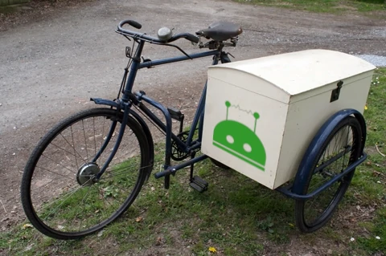

# PuppetSidecar [](https://github.com/wechaty/wechaty-puppet-sidecar/actions?query=workflow%3ANPM)

[](https://badge.fury.io/js/wechaty-puppet-sidecar)
[](https://www.npmjs.com/package/wechaty-puppet-sidecar?activeTab=versions)
[](https://github.com/wechaty/wechaty)
[](https://www.typescriptlang.org/)



> Image source: [1920s Raleigh Box Sidecar Outfit](https://oldbike.wordpress.com/1920s-raleigh-box-sidecar-outfit/) & [ShellterProject](https://www.shellterproject.com/)

Universal Puppet powered by Sidecar, which can help Wechaty connect to any applications.

## Usage

Talk is cheap, show me the code.

### Puppet Sidecar

```ts
import { Wechaty }   from 'wechaty'
import { PuppetSidecar } from 'wechaty-puppet-sidecar'
import { 
  Sidecar,
  SidecarBody,
  Call,
  Ret,
  RetType
  ParamType,
  Hook,
}               from 'frida-sidecar'

@Sidecar('WeChat.exe')
class WeChatSidecar extends SidecarBody {

  @Call(0x1234)
  @RetType('pointer', 'Utf8String')
  messageSendText (
    @ParamType('pointer', 'Utf8String') id: string,
    @ParamType('pointer', 'Utf8String') text: string,
  ) { return Ret(id, text) }

  @Hook(0x5678)
  messageLoop (
    @ParamType('pointer', 'Buffer') protoBuf: Buffer,
  ) { return Ret(protoBuf) }

}

const sidecar = new WeChatSidecar()
const puppet  = new PuppetSidecar({ sidecar })
const wechaty = new Wechaty({ puppet })

wechaty.start()
```

## History

### master

### v0.0.1 (Jun 4, 2021)

Initial version.

## Author

[Huan LI](http://linkedin.com/in/zixia) [Microsoft Regional Director](https://rd.microsoft.com/en-us/huan-li) \<zixia@zixia.net\>

<a href="https://stackexchange.com/users/265499">
  
</a>

## Copyright & License

* Code & Docs © 2021 Huan LI \<zixia@zixia.net\>
* Code released under the Apache-2.0 License
* Docs released under Creative Commons
